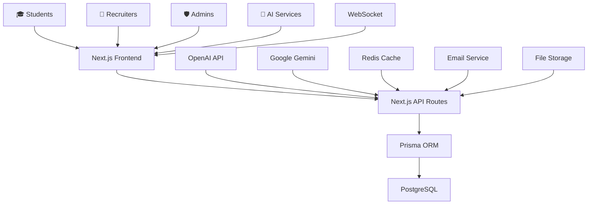

<div align="center">

# HIREZY – AI-Powered Freelancing & Career Intelligence Platform

HIREZY is a full-stack, AI-driven freelancing platform built with Next.js, TypeScript, Prisma, and PostgreSQL. It connects students, freelancers, and recruiters with smart career tools, intelligent gig matching, and enterprise-grade analytics.

This project demonstrates production-ready design, scalable backend architecture, high-quality UI engineering, and AI integrations—reflecting modern MNC-level engineering practices.

---

## 🔹 Key Highlights
- *AI Job & Gig Matching Engine*
- *AI Resume Optimizer*
- *AI Proposal Generator*
- *AI Interview Coach*
- *Recruiter Talent Suite*
- *Admin Analytics Control Center*

---

## 📐 Architecture Overview



---

## 🚀 Technology Stack
- Next.js 14
- TypeScript
- TailwindCSS
- Prisma ORM
- PostgreSQL
- React Query
- Framer Motion
- OpenAI / Gemini APIs

---

## 🔥 Core Features
### Student Dashboard
- AI job matching
- Resume scoring
- Gig proposals
- Career roadmap
- Interview coach

### Recruiter Dashboard
- Post gigs
- AI screening
- Candidate scoring
- Interview setup
- Talent comparison

### Admin Dashboard
- Platform analytics
- User management
- Content moderation
- System controls

---

## ⚡ Quick Start
1. Clone repo
2. Install dependencies
3. Setup .env.local
4. Run Prisma
5. Start dev server

---

## 🧠 AI Features
- Resume enhancement
- Gig success prediction
- Market insights
- Candidate scoring
- Screening automation

---

## 📊 Project Structure
```
hirezy/
├── src/
│   ├── app/                 # Next.js App Router
│   │   ├── admin/          # Admin dashboard pages
│   │   ├── student/        # Student-facing features
│   │   ├── recruiter/      # Recruiter management
│   │   └── api/            # API endpoints
│   ├── components/         # Reusable UI components
│   │   ├── student/        # Student-specific components
│   │   ├── recruiter/      # Recruiter components
│   │   └── ui/             # Base UI library
│   ├── lib/               # Utility functions & services
│   │   ├── ai/            # AI service integrations
│   │   └── auth.ts        # Authentication helpers
│   └── types/             # TypeScript type definitions
├── prisma/               # Database schema & migrations
├── utils/               # Custom utilities & AI services
└── public/              # Static assets
```

---

## 🛠 Future Enhancements
- Mobile App
- AI Voice Interviews
- ML Predictive Matching
- Collaboration Suite

---

## 🤝 Contributing
Open to pull requests and suggestions.

---

## 📄 License
MIT License © 2025

---

## ⭐ Support
Star the repository if this helped you!
