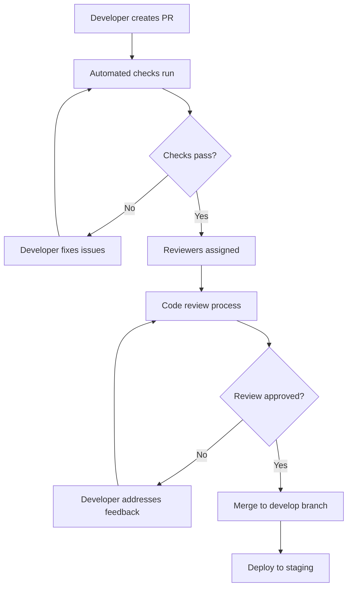

# HIREZY Platform - Development Workflow

## Overview

This document outlines the development workflow, processes, and best practices for the HIREZY platform development team.

## Table of Contents

1. [Development Environment Setup](#development-environment-setup)
2. [Git Workflow](#git-workflow)
3. [Code Review Process](#code-review-process)
4. [Testing Strategy](#testing-strategy)
5. [CI/CD Pipeline](#cicd-pipeline)
6. [Code Quality Standards](#code-quality-standards)
7. [Release Management](#release-management)
8. [Project Management](#project-management)

## Development Environment Setup

### Prerequisites
```bash
# Node.js 18.0+ (LTS recommended)
node --version  # Should be >= 18.0.0

# PostgreSQL 15.x+
psql --version  # Should be >= 15.0

# Docker (optional, for containerized development)
docker --version
```

### Initial Setup
```bash
# 1. Clone repository
git clone https://github.com/your-username/hirezy-platform.git
cd hirezy-platform

# 2. Install dependencies
npm install

# 3. Set up environment
cp .env.example .env.local
# Edit .env.local with your local configuration

# 4. Database setup
# Option A: Local PostgreSQL
createdb hirezy_dev
npx prisma migrate dev
npx prisma db seed

# Option B: Docker
docker-compose up -d postgres
npx prisma migrate dev
npx prisma db seed

# 5. Start development server
npm run dev
```

### Development Tools Configuration

#### VS Code Extensions (Recommended)
```json
{
  "recommendations": [
    "esbenp.prettier-vscode",
    "dbaeumer.vscode-eslint",
    "bradlc.vscode-tailwindcss",
    "ms-vscode.vscode-typescript-next",
    "ms-vscode.vscode-json",
    "formulahendry.auto-rename-tag",
    "christian-kohler.path-intellisense",
    "ms-vscode.vscode-github-issue-notebooks"
  ]
}
```

#### VS Code Settings
```json
{
  "editor.formatOnSave": true,
  "editor.codeActionsOnSave": {
    "source.fixAll.eslint": true
  },
  "typescript.preferences.importModuleSpecifier": "relative",
  "tailwindCSS.includeLanguages": {
    "typescript": "typescript",
    "typescriptreact": "typescript"
  }
}
```

## Git Workflow

### Branching Strategy

We use **Git Flow** with the following branch types:

```
main (production-ready)
├── develop (integration branch)
├── feature/* (feature development)
├── release/* (release preparation)
└── hotfix/* (emergency fixes)
```

### Branch Naming Conventions

#### Feature Branches
```
feature/JIRA-123-add-resume-analysis
feature/add-dark-mode-toggle
feature/integrate-openai-api
```

#### Bug Fix Branches
```
bugfix/JIRA-456-fix-login-error
bugfix/fix-responsive-navbar
```

#### Hotfix Branches
```
hotfix/critical-security-patch
hotfix/fix-payment-processing
```

### Commit Message Convention

We follow **Conventional Commits** specification:

```
<type>[optional scope]: <description>

[optional body]

[optional footer(s)]
```

#### Commit Types
- **feat**: New feature
- **fix**: Bug fix
- **docs**: Documentation changes
- **style**: Code formatting (no logic changes)
- **refactor**: Code refactoring
- **test**: Adding or updating tests
- **chore**: Maintenance tasks
- **perf**: Performance improvements
- **ci**: CI/CD changes

#### Examples
```bash
git commit -m "feat(auth): add OAuth2 integration"
git commit -m "fix(api): resolve CORS issues in user endpoints"
git commit -m "docs(readme): update deployment instructions"
git commit -m "refactor(components): extract common form validation"
```

### Pull Request Guidelines

#### PR Template
```markdown
## Summary
Brief description of changes

## Test plan
- [ ] Test 1
- [ ] Test 2
- [ ] Test 3

## Screenshots (if applicable)
[Add screenshots here]

## Documentation
- [ ] Documentation updated
- [ ] Breaking changes documented

## Checklist
- [ ] Code follows project conventions
- [ ] Tests pass locally
- [ ] No console.log statements
- [ ] Accessibility considerations addressed
```

#### PR Review Process
1. **Automated Checks**: All CI/CD checks must pass
2. **Code Review**: Minimum 1 approval required
3. **Testing**: Manual testing of changes
4. **Documentation**: Update docs if needed
5. **Merge Strategy**: Squash and merge preferred

## Code Review Process

### Review Criteria

#### Code Quality
- [ ] Code follows TypeScript best practices
- [ ] Proper error handling implemented
- [ ] No hardcoded values or secrets
- [ ] Performance considerations addressed
- [ ] Security best practices followed

#### Functionality
- [ ] Feature works as expected
- [ ] Edge cases handled appropriately
- [ ] No breaking changes to existing functionality
- [ ] Tests cover new functionality

#### Maintainability
- [ ] Code is readable and well-commented
- [ ] Functions are appropriately sized
- [ ] Dependencies are properly managed
- [ ] Architecture patterns followed

### Review Workflow


## Testing Strategy

### Testing Pyramid

```
    E2E Tests (Cypress)
   /                    \
  /    Integration     \
 /      Tests          \
/______________________\
      Unit Tests (Jest)
```

### Unit Testing

#### Framework: Jest + React Testing Library
```typescript
// Example unit test
import { render, screen } from '@testing-library/react';
import { ResumeAnalyzer } from './ResumeAnalyzer';

describe('ResumeAnalyzer', () => {
  it('should render analysis results', () => {
    render(<ResumeAnalyzer resumeText="Sample resume" />);
    expect(screen.getByText('Analysis Results')).toBeInTheDocument();
  });
});
```

#### Test Structure
```
src/
├── components/
│   ├── __tests__/
│   │   └── Component.test.tsx
│   └── Component.tsx
├── lib/
│   ├── __tests__/
│   │   └── service.test.ts
│   └── service.ts
└── utils/
    ├── __tests__/
    │   └── helper.test.ts
    └── helper.ts
```

### Integration Testing

#### API Route Testing
```typescript
// Example API test
import { createMocks } from 'node-mocks-http';
import handler from './api/users';

describe('/api/users', () => {
  it('should return user list', async () => {
    const { req, res } = createMocks({
      method: 'GET',
      headers: {
        'Authorization': 'Bearer token'
      }
    });

    await handler(req, res);
    
    expect(res._getStatusCode()).toBe(200);
    expect(JSON.parse(res._getData())).toEqual({
      success: true,
      data: expect.any(Array)
    });
  });
});
```

### E2E Testing

#### Framework: Cypress
```typescript
// Example E2E test
describe('User Registration Flow', () => {
  it('should allow user to register and login', () => {
    cy.visit('/register');
    cy.get('[data-cy=email-input]').type('test@example.com');
    cy.get('[data-cy=password-input]').type('password123');
    cy.get('[data-cy=register-button]').click();
    
    cy.url().should('include', '/dashboard');
    cy.get('[data-cy=user-avatar]').should('be.visible');
  });
});
```

### Test Coverage Requirements
- **Minimum Coverage**: 80% overall
- **Critical Paths**: 95% coverage
- **New Features**: 100% coverage required
- **API Routes**: Integration tests mandatory

## CI/CD Pipeline

### GitHub Actions Workflow

#### Development Pipeline
```yaml
# .github/workflows/development.yml
name: Development Pipeline

on:
  pull_request:
    branches: [develop, feature/*]

jobs:
  test:
    runs-on: ubuntu-latest
    steps:
      - uses: actions/checkout@v3
      - uses: actions/setup-node@v3
        with:
          node-version: '18'
          cache: 'npm'
      
      - run: npm ci
      - run: npm run lint
      - run: npm run typecheck
      - run: npm run test:coverage
      - run: npm run build
```

#### Production Pipeline
```yaml
# .github/workflows/production.yml
name: Production Deployment

on:
  push:
    branches: [main]

jobs:
  deploy:
    runs-on: ubuntu-latest
    environment: production
    steps:
      - uses: actions/checkout@v3
      - uses: actions/setup-node@v3
        with:
          node-version: '18'
          cache: 'npm'
      
      - run: npm ci
      - run: npm run build
      - run: npm run test:e2e
      
      - name: Deploy to Vercel
        uses: amondnet/vercel-action@v20
        with:
          vercel-token: ${{ secrets.VERCEL_TOKEN }}
          vercel-org-id: ${{ secrets.VERCEL_ORG_ID }}
          vercel-project-id: ${{ secrets.VERCEL_PROJECT_ID }}
          vercel-args: '--prod'
```

### Quality Gates

#### Pre-commit Hooks
```json
{
  "husky": {
    "hooks": {
      "pre-commit": "lint-staged",
      "commit-msg": "commitlint -E HUSKY_GIT_PARAMS"
    }
  },
  "lint-staged": {
    "*.{ts,tsx}": [
      "eslint --fix",
      "prettier --write",
      "git add"
    ],
    "*.{json,md}": [
      "prettier --write",
      "git add"
    ]
  }
}
```

#### Quality Checks
- **ESLint**: Code quality and style
- **Prettier**: Code formatting
- **TypeScript**: Type checking
- **Security**: Dependency vulnerability scanning
- **Performance**: Bundle size monitoring

## Code Quality Standards

### TypeScript Guidelines

#### Strict Mode Configuration
```typescript
// tsconfig.json
{
  "compilerOptions": {
    "strict": true,
    "noImplicitAny": true,
    "strictNullChecks": true,
    "strictFunctionTypes": true,
    "noImplicitReturns": true,
    "noUnusedLocals": true,
    "noUnusedParameters": true
  }
}
```

#### Type Definitions
```typescript
// Always prefer explicit types
interface User {
  id: string;
  email: string;
  role: 'student' | 'recruiter' | 'admin';
}

// Use utility types
type ApiResponse<T> = {
  success: boolean;
  data: T;
  meta?: {
    timestamp: string;
    version: string;
  };
};

// Avoid any type
const processData = (data: unknown): ProcessedData => {
  // Type assertion with validation
  if (typeof data === 'object' && data !== null) {
    return data as ProcessedData;
  }
  throw new Error('Invalid data format');
};
```

### React Best Practices

#### Component Structure
```typescript
// Functional component with TypeScript
interface DashboardProps {
  user: User;
  onLogout: () => void;
}

export const Dashboard: React.FC<DashboardProps> = ({ user, onLogout }) => {
  // State management
  const [loading, setLoading] = useState(false);
  const [error, setError] = useState<string | null>(null);

  // Effects
  useEffect(() => {
    const fetchData = async () => {
      try {
        setLoading(true);
        // Data fetching logic
      } catch (err) {
        setError(err instanceof Error ? err.message : 'Unknown error');
      } finally {
        setLoading(false);
      }
    };

    fetchData();
  }, []);

  // Render
  if (loading) return <LoadingSpinner />;
  if (error) return <ErrorMessage message={error} />;

  return (
    <div className="dashboard">
      <h1>Welcome, {user.name}</h1>
      {/* Component content */}
    </div>
  );
};
```

#### Error Boundaries
```typescript
// Error boundary component
interface ErrorBoundaryState {
  hasError: boolean;
  error?: Error;
}

export class ErrorBoundary extends Component<
  React.PropsWithChildren<{}>,
  ErrorBoundaryState
> {
  constructor(props: React.PropsWithChildren<{}>) {
    super(props);
    this.state = { hasError: false };
  }

  static getDerivedStateFromError(error: Error): ErrorBoundaryState {
    return { hasError: true, error };
  }

  componentDidCatch(error: Error, errorInfo: React.ErrorInfo) {
    console.error('Error caught by boundary:', error, errorInfo);
    // Log to error tracking service
  }

  render() {
    if (this.state.hasError) {
      return <ErrorFallback error={this.state.error} />;
    }

    return this.props.children;
  }
}
```

### Performance Guidelines

#### Code Splitting
```typescript
// Dynamic imports for route-based splitting
const LazyComponent = dynamic(
  () => import('./HeavyComponent'),
  {
    loading: () => <SkeletonLoader />,
    ssr: false // Disable SSR for client-only components
  }
);

// Component-based splitting
const Dashboard = () => {
  const [showAnalytics, setShowAnalytics] = useState(false);
  
  return (
    <div>
      <MainContent />
      {showAnalytics && <LazyAnalytics />}
    </div>
  );
};
```

#### Memoization
```typescript
// Use memoization for expensive calculations
const ExpensiveComponent = ({ data }: { data: LargeDataSet }) => {
  const expensiveValue = useMemo(() => {
    return data.reduce((acc, item) => acc + item.value, 0);
  }, [data]);

  const memoizedCallback = useCallback((id: string) => {
    return data.find(item => item.id === id);
  }, [data]);

  return <div>{expensiveValue}</div>;
};
```

## Release Management

### Versioning Strategy

We use **Semantic Versioning** (MAJOR.MINOR.PATCH):

- **MAJOR**: Breaking changes
- **MINOR**: New features (backward compatible)
- **PATCH**: Bug fixes (backward compatible)

### Release Process

#### Pre-release Checklist
- [ ] All tests pass
- [ ] Code review completed
- [ ] Documentation updated
- [ ] Breaking changes documented
- [ ] Changelog updated
- [ ] Security review (if applicable)

#### Release Steps
```bash
# 1. Create release branch
git checkout develop
git pull origin develop
git checkout -b release/v1.2.0

# 2. Update version numbers
npm version patch --no-git-tag-version
# Update package.json, changelog, etc.

# 3. Create pull request
git add .
git commit -m "chore: prepare v1.2.0 release"
git push origin release/v1.2.0

# 4. Merge to main and tag
git checkout main
git merge release/v1.2.0
git tag v1.2.0
git push origin main --tags

# 5. Deploy to production
# Triggered automatically by CI/CD
```

#### Post-release
- [ ] Monitor production deployment
- [ ] Update documentation
- [ ] Announce release (if applicable)
- [ ] Clean up release branch

### Changelog Format
```markdown
## [1.2.0] - 2024-01-15

### Added
- Resume analysis feature
- Dark mode toggle
- Mobile responsive design

### Changed
- Updated authentication flow
- Improved performance of dashboard

### Fixed
- Fixed login redirect issue
- Resolved mobile navigation bug

### Removed
- Deprecated API endpoints
```

## Project Management

### Agile Methodology

We follow **Scrum** framework with 2-week sprints:

#### Sprint Structure
- **Sprint Planning**: Every 2 weeks (Monday)
- **Daily Standups**: 15 minutes (9:00 AM)
- **Sprint Review**: End of sprint (Friday)
- **Retrospective**: After review (Friday)

#### Roles and Responsibilities

**Product Owner**
- Defines product vision and roadmap
- Prioritizes backlog items
- Accepts completed features

**Scrum Master**
- Facilitates ceremonies
- Removes impediments
- Ensures process adherence

**Development Team**
- Estimates and plans work
- Implements features
- Maintains code quality

### Task Management

#### Issue Templates
```markdown
## Bug Report
**Title**: [Brief description of the issue]

**Steps to Reproduce**:
1. Go to [page]
2. Click on [button]
3. See error

**Expected Behavior**: [Description]
**Actual Behavior**: [Description]

**Environment**:
- OS: [e.g., Windows 10]
- Browser: [e.g., Chrome 91]
- Version: [e.g., 1.0.0]

**Screenshots**: [If applicable]
```

#### Story Template
```markdown
## User Story
As a [user type], I want [goal] so that [reason].

## Acceptance Criteria
- [ ] Given [context], when [action], then [outcome]
- [ ] Given [context], when [action], then [outcome]

## Definition of Done
- [ ] Code review completed
- [ ] Tests written and passing
- [ ] Documentation updated
- [ ] Feature tested in staging
```

### Communication Guidelines

#### Team Communication
- **Slack**: Daily communication and quick questions
- **GitHub Issues**: Task tracking and bug reports
- **Email**: Formal communication and announcements
- **Video Calls**: Complex discussions and planning

#### Code Communication
- **Pull Request Descriptions**: Clear explanation of changes
- **Commit Messages**: Follow conventional commits
- **Code Comments**: Explain complex logic and decisions
- **Documentation**: Keep docs up to date

### Metrics and Monitoring

#### Development Metrics
- **Velocity**: Story points completed per sprint
- **Cycle Time**: Time from start to completion
- **Code Coverage**: Test coverage percentage
- **Bug Rate**: Bugs per story point

#### Quality Metrics
- **Code Review Time**: Average time for reviews
- **Build Success Rate**: Percentage of successful builds
- **Deployment Frequency**: How often we deploy
- **Mean Time to Recovery**: Time to fix production issues

This workflow ensures consistent, high-quality development practices while maintaining team productivity and code maintainability.